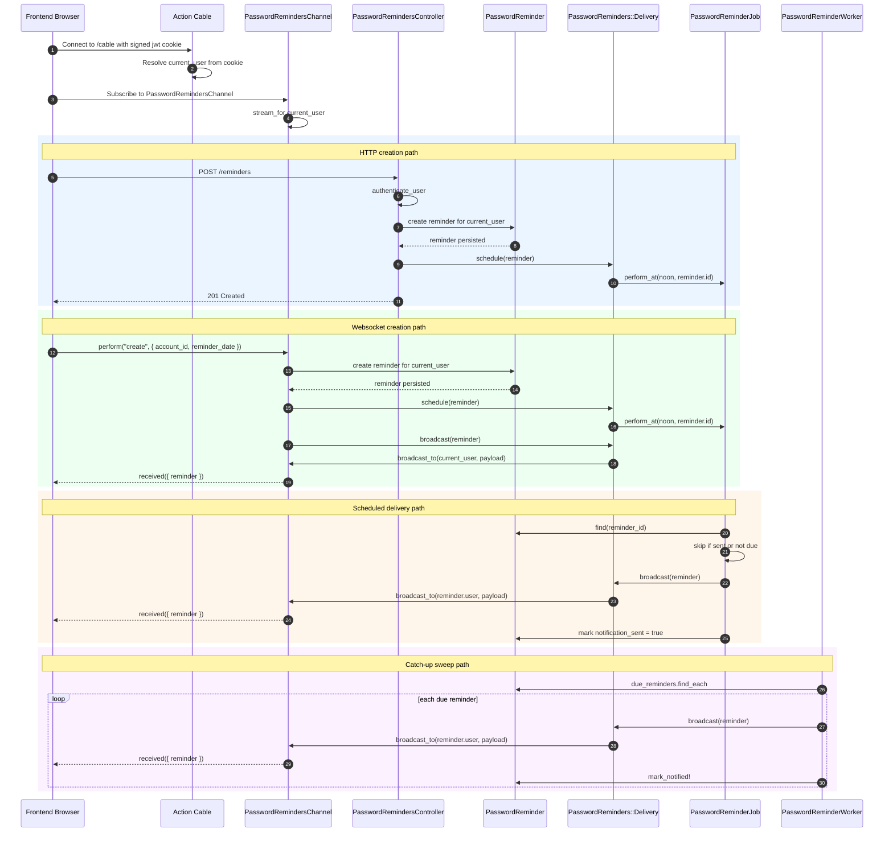

# Password Reminder Websocket Flow

## Notes

- Both HTTP and websocket reminder creation now use the same scheduling service.
- All outbound websocket payloads flow through `PasswordReminders::Delivery.broadcast`.
- Delivery is user-scoped because the channel subscribes with `stream_for current_user`.
- The websocket create path gives an immediate echo of the newly created reminder and also schedules future delivery.
